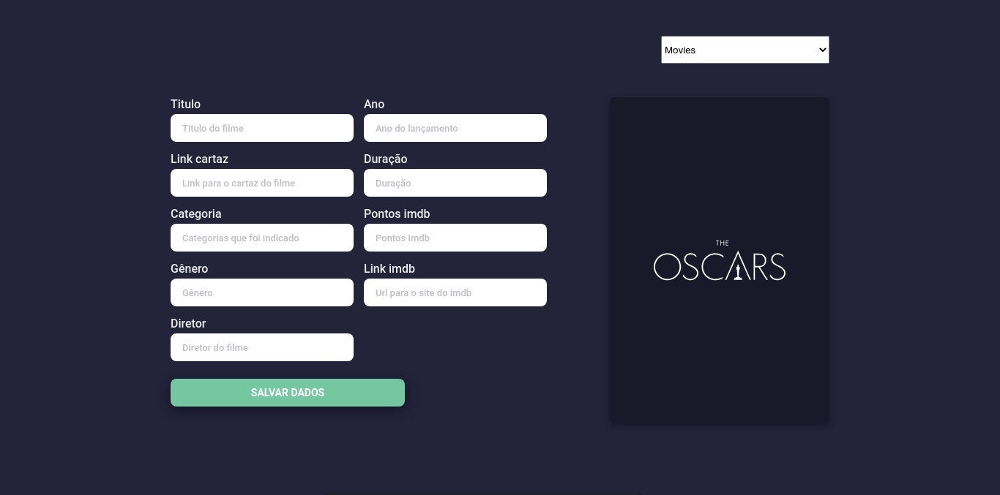

# Api de listagens de filmes indicados ao oscar 2022

Uma api de listagens dos filmes indicados ao oscar 2022.

 

## Descrição

  Essa é uma aplicação desenvolvida em Node.js com SqLite e sequelize. O objetivo do
  projeto é desenvolver uma api para listar os indicados ao oscar, usando um banco de dados sqLite.

## Documentação

  Toda api está foi documentada, e pode ser acessada a partir do /doc ao iniciar o servidor.

## Iniciando projeto

  Toda a api é bem simples e o banco de dados já foi populado.

  ## Baixando

    > git clone git@github.com:lucasfernandodev/snake.git

  ## Instalando dependências 

    > cd snake

    > npm install ci

  ## Iniciando projeto

    > npm run start

    ou

    > npm run nodemon

## Features

  - Create
  - Update
  - Delete
  - Find
  - FindAll
  - Filter(director, category, genre)

